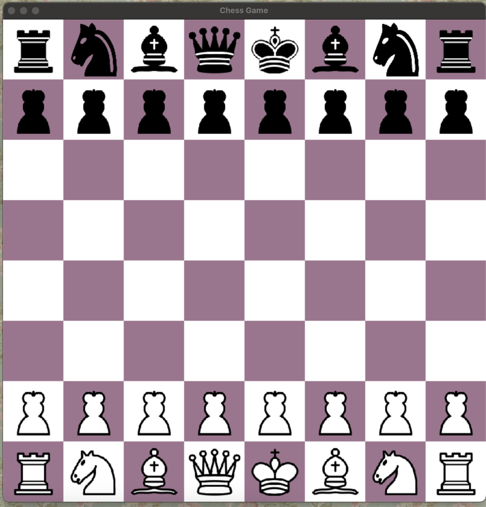
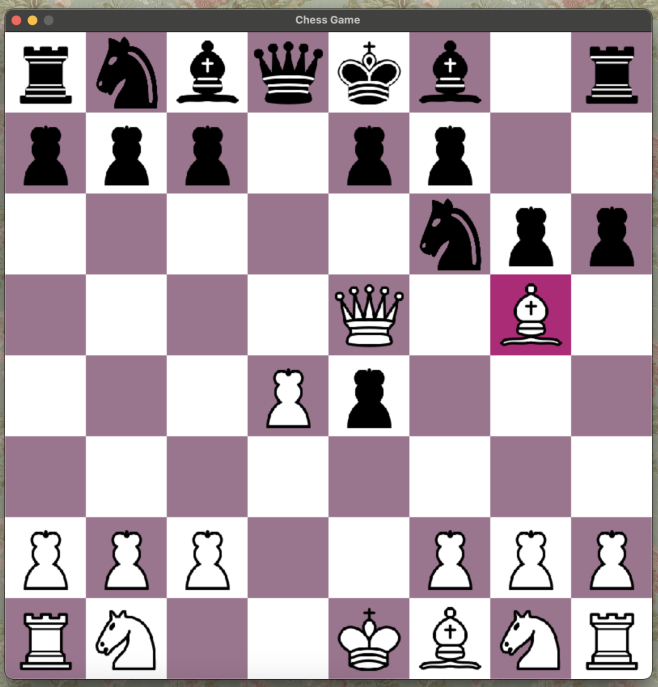

# CHESS GAME
## Introduction
This python program allows two users to play chess locally. The UI has a clean and simple aesthetic that makes it easy to use and visually pleasant. When a piece is selected, it lights up as a pink box(shown below).

## How it works
Two players share one screen and one keyboard/mouse
Players take turns making moves
The game checks for legal moves and valid piece movement
Standard chess rules apply (check, checkmate, castling, etc.)

